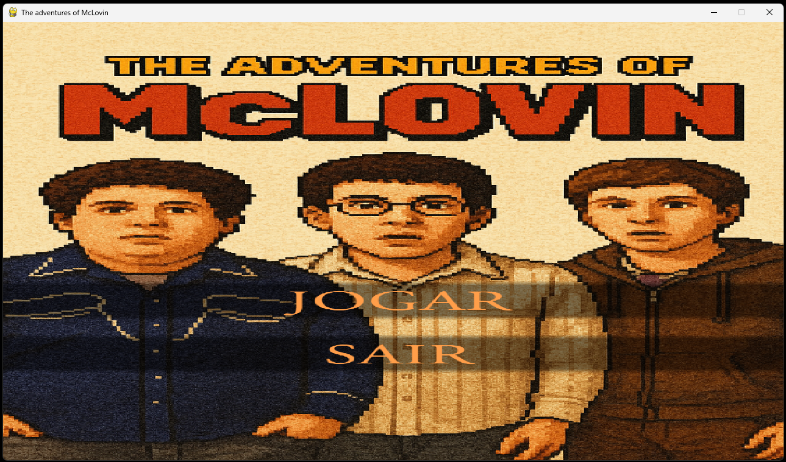

# The adventures of McLovin
## Membros:
- Almério Jackson Pires de Carvalho Filho (ajpcf)
- Arthur Duque da Costa Pinto (adcp)
- Eduardo Fortunato da Silva (efs15)
- Jhoranes Gabriel Silva Alves (jgsa2)
- João Azevedo Cavalcanti (jac2)
## Arquitetura:
O código gira em torno de uma função principal que recebe os inputs, gerencia as atualizações da tela, as colisões com os objetos e o status de vitória ou derrota; uma função de tela inicial, uma função de game over e algumas funções para aleatorizar o spawn dos objetos, configurar o personagem, suas animações e movimentação.
## Capturas de tela:
Tela inicial:

Tela de derrota:

## Ferramentas utilizadas:
O projeto conta com ferramentas como a biblioteca pygame, culturalmente utilizada nesse primeiro projeto da disciplina e que permite a criação de jogos 2D em python; GitHub como sistema de versionamento do código, o Visual Studio Code como IDE, o chat GPT para criação de sprites e imagens e softwares de edição de imagem e áudio.
## Divisão de trabalho:
- Almério: Implementação de sfx, revisão de código, organização e monitoramento do repositório, e suporte no código.
- Arthur: Suporte no código principal.
- Eduardo: Programação das Telas de início,fim e suporte no código principal.
- Jhoranes: Sprites, imagens e suporte no código.
- João: Personagem principal e sua movimentação, estrutura dos coletáveis, modularização inicial e suporte no código.
## Conceitos implementados:
Em nosso código utilizamos conceitos como:
- Utilização e manipulação de funções para grande parte das funcionalidades;
- Laços de repetição para criar loops consistentes e funcionais;
- Modularização para criar um código mais fácil de ser entendido e modificado;
- Programação Orientada a Objetos para conseguir modelar o ambiente do jogo e suas funções;
- Boas práticas para que o código fique organizado e fácil de ser entendido;
- Versionamento de código para sincronizar os ambientes de todos os membros do grupo e manter o código sempre em sua melhor versão.
## Qual foi o maior erro cometido durante o projeto? Como vocês lidaram com ele?
O projeto fluiu bem, sem grande erros, apenas detalhes perdidos que foram consertados rapidamente.
## Qual foi o maior desafio enfrentado durante o projeto? Como vocês lidaram com ele?
O maior desafio foi aprender a modularizar e versionar o código, tendo em vista que os códigos desenvolvidos durante todo o período eram monolíticos.
## Quais as lições aprendidas durante o projeto?
Esse projeto foi o empurrão necessário para aprendermos organização de projetos, trabalho em equipe, versionamento de código e as ferramentas necessárias como POO e modularização.

# Créditos:
        - Trilha sonora e SFX:
        Jonny Fabisak
